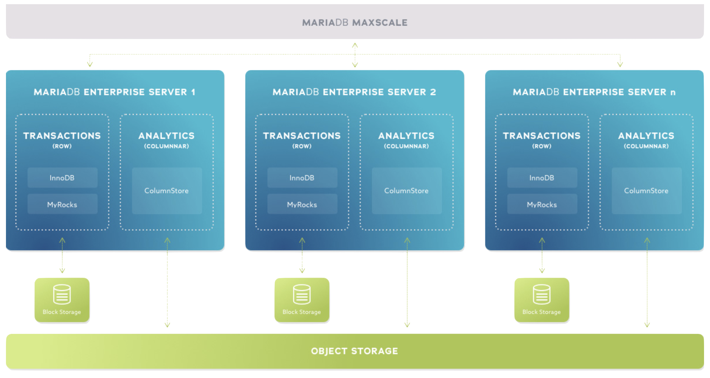
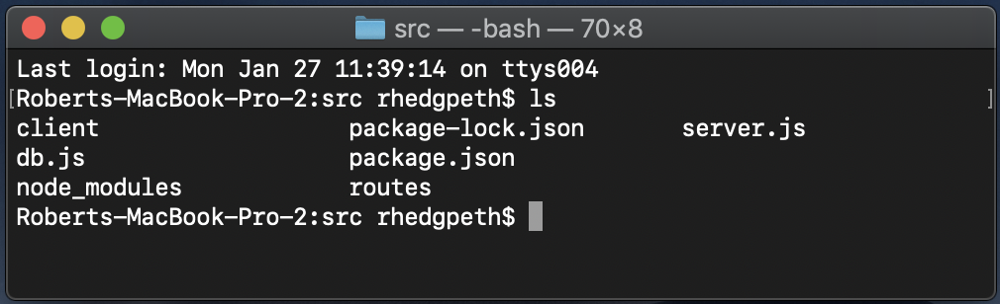
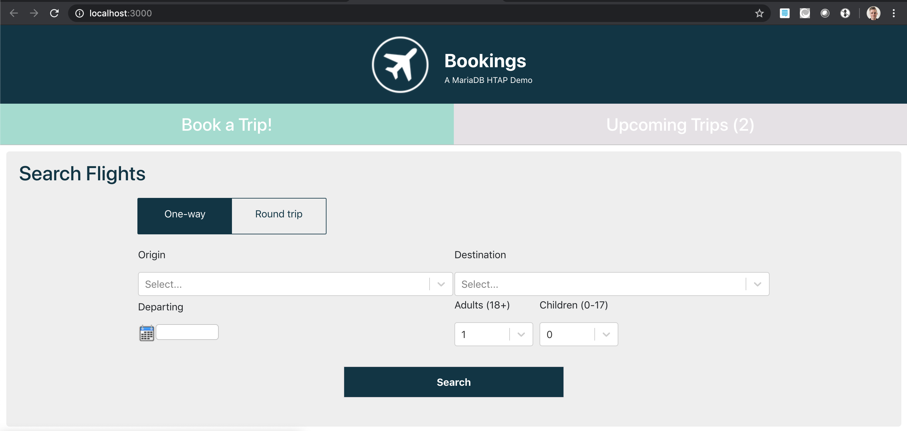
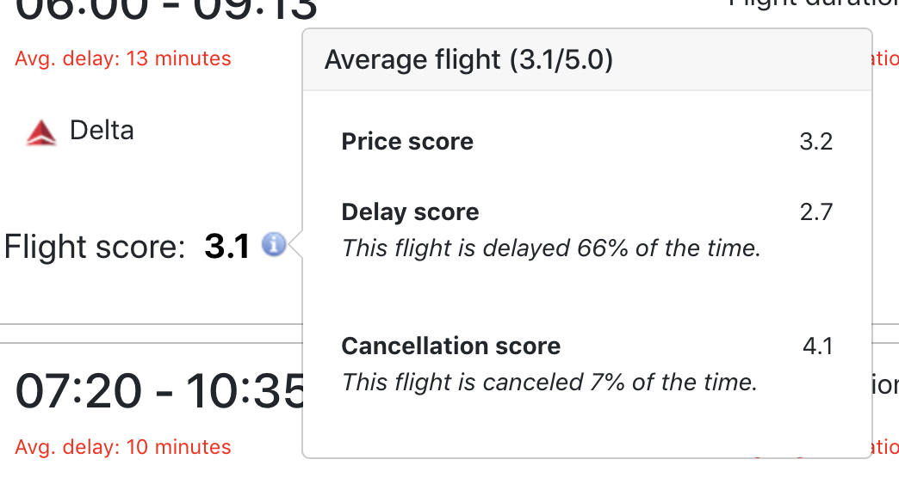
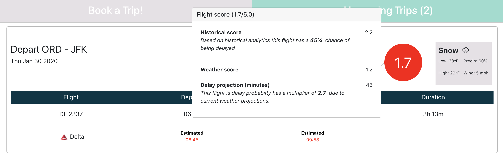
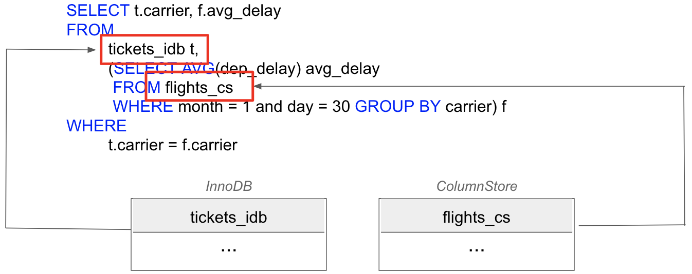

# Bookings

**Bookings** is a web application written in [ReactJS](https://reactjs.org) and [NodeJS](https://nodejs.org) that, backed by the power of the [MariaDB Node Connector](https://github.com/MariaDB/mariadb-connector-nodejs) and the [MariaDB X4 Platform](https://mariadb.com/resources/blog/deploying-mariadb-platform-x4/#smart), unleashes the power of [smart transactions](https://mariadb.com/resources/blog/introducing-mariadb-platform-x4-smart-transactions-and-cloud-native-storage/) on hundreds of millions of records with sub-second query performance without having to add any indexes!

<p align="center" spacing="10">
    <kbd>
        
    </kbd>
</p>

The following will walk you through the steps for getting this application up and running (locally) within minutes! This application is completely open source. Please feel free to use it and the source code as you see fit! 

# Table of Contents
1. [Environment and Compatibility](#compatibility)
2. [Getting started with MariaDB and Hybrid Transactional-Analytical Processing](#overview)
    1. [The Basics](#intro-mariadb)
    2. [Deploying MariaDB HTAP](#installation)
    3. [Clone repo](#clone-repo)
    3. [Retrieving flight data](#retrieve-data)
    4. [Create the schema](#create-schema)
    5. [Load airport, airline, and flight data](#load-data)
    6. [Setting up replication](#replication)
3. [Requirements to run the app](#requirements)
4. [Getting started with the app](#getting-started)
    1. [Grab the code](#grab-code)
    2. [Build the code](#build-code)
    3. [Run the app](#run-app)
    4. [Creating data](#create-data)
5. [Smart Transactions](#smart-transactions)
6. [Cross-Engine Queries](#cross-engine-queries)
7. [Support and Contribution](#support-contribution)
8. [License](#license)

## Environment and Compatibility <a name="compatibility"></a>

This sample was created using the following techologies:

* [MariaDB X4 HTAP (v10.4)](https://github.com/mariadb-corporation/mariadb-columnstore-htap)
* [React.js (v.16.12.0)](https://github.com/facebook/react/blob/master/CHANGELOG.md#16120-november-14-2019)
* [Node.js (v.12.x)](https://nodejs.org/docs/latest-v12.x/api/index.html)
* [NPM (v.6.11.3)](https://docs.npmjs.com/)

This sample was tested on macOS v.10.14.6.

## Overview <a name="overview"></a>

### Introduction to MariaDB <a name="intro-mariadb"></a>

[MariaDB platform](https://mariadb.com/products/mariadb-platform/) unifies [MariaDB TX (transactions)](https://mariadb.com/products/mariadb-platform-transactional/) and [MariaDB AX (analytics)](https://mariadb.com/products/mariadb-platform-analytical/) so transactional applications can retain unlimited historical data and leverage powerful, real-time analytics in order to provide data-driven customers with more information, actionable insight and greater value – and businesses with endless ways to monetize data. It is the enterprise open source database for hybrid transactional/analytical processing at scale.

<p align="center">
    <kbd>
        
    </kbd>
</p>

### Deploying MariaDB Hybrid Transactional-Analytical Processing (HTAP) <a name="installation"></a>

MariaDB Platform supports [Hybrid Transactional-Analytical Processing (HTAP)](https://mariadb.com/docs/deploy/htap/) through a combination of MariaDB Enterprise Server, MariaDB ColumnStore, and MariaDB MaxScale.

Here's a simple architecture diagram of MariaDB X4 Platform.

<p align="center" spacing="10">
    <kbd>
        
    </kbd>
</p>

For this application we'll be targeting a single instance of MariaDB HTAP, and instructions for setting such an environment can be found here:

https://github.com/mariadb-corporation/mariadb-columnstore-htap

Once you have created your HTAP instance you will be able to create the schemas and load the data. If you have elected to use the method above you simply need to use

``` 
$ vagrant ssh node1
```

to access the database instance. 

**Note:** You can also find more details on how to *manually* deploy MariaDB X4 [here](https://mariadb.com/docs/deploy/htap/).

### Clone repo <a name="clone-repo"></a>

Next `git clone` this repository to the machine that contains your database instance, and then proceed to the following steps for retrieving flight data, creating schemas, and loading airports/airlines/flight data.

### Retrieving flight data <a name="retrieve-data"></a>

This application uses flight record data provided by the [Bureau of Transportation](https://www.bts.gov/).

The following script will retrieve the data set by year and month creating CSV data files under the data directory. By default the script will retrieve data for all months from 1990 to 2020. The script can be edited to retrieve smaller or larger data ranges as needed:

```
$ ./get_flight_data.sh

2018-011
  % Total    % Received % Xferd  Average Speed   Time    Time     Time  Current
                                 Dload  Upload   Total   Spent    Left  Speed
100   654  100   183  100   471     12     33  0:00:15  0:00:14  0:00:01     0
100 14.9M  100 14.9M    0     0   415k      0  0:00:36  0:00:36 --:--:--  736k
Archive:  data.zip
  inflating: 544122566_.csv
2018-02
```

**Note:** The script makes use of curl and unzip which may need to be installed if not already present on your Linux OS.

### Create the schema <a name="create-schema"></a>

The following script will create (and drop if it already exists) the flights database:

```
$ ./create_schemas.sh
```

This includes the following 6 tables within the schema `innodb_schema`:

 * airlines
 * airports
 * flights
 * tickets
 * trips

 This also includes the following table within the schema `columnstore_schema`:

 * flights

### Loading Flights data into ColumnStore <a name="load-data"></a>

The airlines and airports table can be populated from the airlines.csv and airports.csv files in the schema directory. Use the following script to do this:

```
$ ./load_airports_airlines.sh
```

The flights table is populated using a script which will load each CSV file from the data directory into the flights table:

```
$ ./load_flight_data.sh
```

### Setting up HTAP Replication <a name="htap-replication"></a>

Using MariaDB Replication, MariaDB Enterprise Server replicates writes from InnoDB tables to the MariaDB ColumnStore tables, ensuring that the application can perform analytical processing on current data. Combining MariaDB Replication with MariaDB MaxScale configured as a Binlog Server, MariaDB Enterprise Server can host InnoDB and ColumnStore on the same Server.

This application uses replication on a single table called `flights`, which exists `innodb_schema` and `columnstore_schema`. In order to set up replication add the following to `/etc/maxscale.cnf` for your HTAP instance.

```
[replication-filter]
type         = filter
module       = binlogfilter
match        = /[.]flights/
rewrite_src  = innodb
rewrite_dest = columnstore
```

For more information on configuring MariaDB HTAP please review the official [Enterprise Documentation](https://mariadb.com/docs/deploy/htap/#maxscale-configuration).

## Requirements to run the app <a name="requirements"></a>

This project assumes you have familiarity with building web applications using [ReactJS](https://reactjs.org) and [NodeJS](https://nodejs.org) technologies. 

The following is required to run this application:

1. [Download and install MariaDB HTAP](#installation). 
2. [Download and install NodeJS](https://nodejs.org/en/download/).
3. git (Optional) - this is required if you would prefer to pull the source code from GitHub repo.
    - Create a [free github account](https://github.com/) if you don’t already have one
    - git can be downloaded from git-scm.org

## Getting started with the app <a name="getting-started"></a>

### Grab the code <a name="grab-code"></a>

Download this code directly or use [git](http://www.git-scm.org) (through CLI or a client) to retrieve the code.

### Configure the code <a name="configure-code"></a>

Configure the MariaDB connection by [adding an .env file to the Node.js project](https://github.com/mariadb-corporation/mariadb-connector-nodejs/blob/master/documentation/promise-api.md#security-consideration).

Example implementation:

```
DB_HOST=<host_address>
DB_PORT=<port_number>
DB_USER=<username>
DB_PASS=<password>
DB_NAME=<database>
```

### Build the code <a name="build-code"></a>

Once you have retrieved a copy of the code you're ready to build and run the project! However, before running the code it's important to point out that the application uses several Node Packages.

Executing the CLI command `npm install` within the [src](src) AND [client](src/client) folders will target the the relative `package.json` file and install all dependencies.


For more information on `npm install` check out the [Official Node.js Documentation](https://docs.npmjs.com/downloading-and-installing-packages-locally).

### Run the app <a name="run-app"></a>

Once you've pulled down the code and have verified that all of the required Node packages are installed you're ready to run the application! It's as easy as 1,2,3.

1. Using a command line interface (CLI) navigate to the `src` directory.

<p align="center">
    <kbd>
        
    </kbd>
</p>

2. Run the command:

```bash
npm start
```

<p align="center">
    <kbd>
        
    </kbd>
</p>

3. Open a browser window and navigate to http://localhost:3000.

<p align="center">
    <kbd>
        
    </kbd>
</p>

### Adding data for the app <a name="create-data"></a>

**Upcoming flight data**

Upon running the application you will notice that searching for flights and viewin upcoming trips yields no results. This is because there currently no transactional flights, tickets, or trips data. Because this application is merely meant for demonstration purposes only you will need to provide *relevant* data within the following:

* innodb_schema.flights
* innodb_schema.tickets
* innodb_schema.trips

The following are sample datasets for:

An upcoming flight (option) from LAX to ORD on February 5th, 2020.

```sql
INSERT INTO `flights` (`year`, `month`, `day`, `day_of_week`, `fl_date`, `carrier`, `tail_num`, `fl_num`, `origin`, `dest`, `crs_dep_time`, `dep_time`, `dep_delay`, `taxi_out`, `wheels_off`, `wheels_on`, `taxi_in`, `crs_arr_time`, `arr_time`, `arr_delay`, `cancelled`, `cancellation_code`, `diverted`, `crs_elapsed_time`, `actual_elapsed_time`, `air_time`, `distance`, `carrier_delay`, `weather_delay`, `nas_delay`, `security_delay`, `late_aircraft_delay`) VALUES (2020, 2, 5, 5, '2020-02-05', 'DL', NULL, 1280, 'LAX', 'ORD', '0600', '0600', NULL, NULL, NULL, NULL, NULL, '0913', '0913', NULL, NULL, NULL, NULL, NULL, NULL, NULL, NULL, NULL, NULL, NULL, NULL, NULL);

INSERT INTO `tickets` (`id`, `fl_date`, `fl_num`, `carrier`, `origin`, `dest`, `price`) VALUES (1, '2020-02-05', 1280, 'DL', 'LAX', 'ORD', 240.00);
```

An upcoming trip from ORD to LAX on February 6th, 2020.

```sql
INSERT INTO `flights` (`year`, `month`, `day`, `day_of_week`, `fl_date`, `carrier`, `tail_num`, `fl_num`, `origin`, `dest`, `crs_dep_time`, `dep_time`, `dep_delay`, `taxi_out`, `wheels_off`, `wheels_on`, `taxi_in`, `crs_arr_time`, `arr_time`, `arr_delay`, `cancelled`, `cancellation_code`, `diverted`, `crs_elapsed_time`, `actual_elapsed_time`, `air_time`, `distance`, `carrier_delay`, `weather_delay`, `nas_delay`, `security_delay`, `late_aircraft_delay`) VALUES (2020, 2, 6, 2, '2020-02-06', 'DL', NULL, 1170, 'ORD', 'LAX', '1420', '1420', NULL, NULL, NULL, NULL, NULL, '1730', '1730', NULL, NULL, NULL, NULL, NULL, NULL, NULL, NULL, NULL, NULL, NULL, NULL, NULL);

INSERT INTO `tickets` (`id`, `fl_date`, `fl_num`, `carrier`, `origin`, `dest`, `price`) VALUES (2, '2020-02-06', 1170, 'DL', 'ORD', 'LAX', 276.00);

INSERT INTO `trips` (`id`, `ticket_id`) VALUES (1, 4);
```

**Weather forecast data**

You also have the option of hard-coding your weather forecast information or integrating a Weather Forecast API of your choice. Currently the data is hard-coded, but can facilitate either approach.

Check out [tripRoutes.js](https://github.com/mariadb-corporation/Developer-Examples/blob/master/Bookings/src/routes/tripsRoutes.js#L105-L122) to learn more.

```js
var forecasts = {
    "ORD_2020-02-06": {
        description: "Snow",
        icon: "snow",
        temp_low: "28°F",
        temp_high: "29°F",
        precip_probability: 0.6,
        wind_speed: 15
    },
    "LAX_2020-02-08": {
        description: "Clear",
        icon: "clear-day",
        temp_low: "56°F",
        temp_high: "65°F",
        precip_probability: 0,
        wind_speed: 5
    }
};
```

## Smart Transactions <a name="smart-transactions"></a>

At this point you're probably wondering, what are smart transactions?

At their core, smart transactions are the standard transactions that databases have been performing for decades – ultimately powering the online interactions we’ve become accustomed to. The difference with modern applications is the use of real-time analytics before, during and/or after these transactions.

**Pre-transaction**

This application uses real-time analytics before a flight is booked. Each flight ticket option contains information calculated from the historical records (average delay, average duration, flight score, etc.) within the `flights` table.

<p align="center">
    <kbd>
        
    </kbd>
</p>

<p align="center">
    <kbd>
        
    </kbd>
</p>

**Post-transaction**

This application also uses real-time analytics after a flight has been booked, and a trip has been created. 

<p align="center">
    <kbd>
        
    </kbd>
</p>

## Cross-Engine Queries <a name="cross-engine-queries"></a>

This application uses cross-engine queries to maximize the potentials of the MariaDB X4 Platform. Cross-engine querying is the ability to access, via MaxScale, both the transactional and analytics data within a single query.  

<p align="center">
    <kbd>
        
    </kbd>
</p>

## Support and Contribution <a name="support-contribution"></a>

Thanks so much for taking a look at the Bookings app! As this is a very simple example, there's plenty of potential for customization. Please feel free to submit PR's to the project to include your modifications!

If you have any questions, comments, or would like to contribute to this or future projects like this please reach out to us directly at developers@mariadb.com or on [Twitter](https://twitter.com/mariadb).

## License <a name="license"></a>
[](https://opensource.org/licenses/Apache-2.0)
