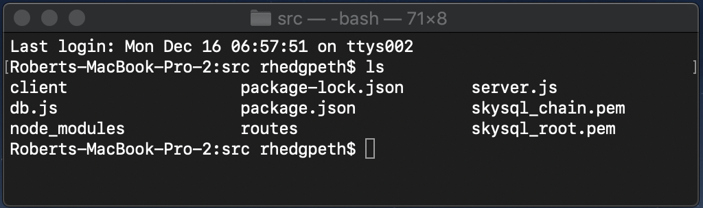

# Flights

**Flights** is a web application written in [ReactJS](https://reactjs.org) and [NodeJS](https://nodejs.org) that, backed by the power of the [MariaDB Node Connector](https://github.com/MariaDB/mariadb-connector-nodejs) and [MariaDB ColumnStore database](https://mariadb.com/docs/features/mariadb-columnstore/), allows you to analyze over 180 million [flight records from the United States Department of Transportation](https://www.transtats.bts.gov/DL_SelectFields.asp?Table_ID=236&DB_Short_Name=On-Time) in real time without needing to add any indexes!

<p align="center" spacing="10">
    
</p>

This `README` will walk you through the steps for getting this app up and running (locally) within minutes!

# Table of Contents
1. [Getting started with MariaDB](#overview)
    1. [The Basics](#intro-mariadb)
    2. [Downloading and installing MariaDB ColumnStore](#installation)
2. [Requirements](#requirements)
3. [Getting started with the app](#getting-started)
    1. [Get the data, create the schema, and load the data](#data)
    1. [Grab the code](#grab-code)
    2. [Build the code](#build-code)
    3. [Run the app](#run-app)
4. [Support and Contribution](#support-contribution)

## Overview <a name="overview"></a>

### Introduction to MariaDB <a name="intro-mariadb"></a>

[MariaDB platform](https://mariadb.com/products/mariadb-platform/) unifies [MariaDB TX (transactions)](https://mariadb.com/products/mariadb-platform-transactional/) and [MariaDB AX (analytics)](https://mariadb.com/products/mariadb-platform-analytical/) so transactional applications can retain unlimited historical data and leverage powerful, real-time analytics in order to provide data-driven customers with more information, actionable insight and greater value – and businesses with endless ways to monetize data. It is the enterprise open source database for hybrid transactional/analytical processing at scale.

<p align="center">
    
</p>

### Downloading and installing MariaDB ColumnStore <a name="installation"></a>

[MariaDB ColumnStore](https://mariadb.com/docs/features/mariadb-columnstore/) extends [MariaDB Server](https://mariadb.com/products/) with distributed storage and massively parallel processing to support scalable, high-performance analytics. It can be deployed as the analytics component of MariaDB Platform using MariaDB MaxScale for change-data-capture and hybrid transactional/analytical query routing, or as a standalone columnar database for interactive, ad hoc analytics at scale. You can find more information on how to download and install ColumnStore [here](https://mariadb.com/downloads/#mariadb_platform-mariadb_columnstore).

## Requirements <a name="requirements"></a>

This project assumes you have familiarity with building web applications using ReactJS and NodeJS technologies. 

* Download and install [MariaDB ColumnStore database](https://go.mariadb.com/download-mariadb-server-community.html?utm_source=google&utm_medium=ppc&utm_campaign=MKG-Search-Google-Branded-DL-NA-Server-DL&gclid=CjwKCAiAwZTuBRAYEiwAcr67OUBIqnFBo9rUBhYql3VZV_nhlSKzkwoUv7vhA6gwNdGoBSc2uWe7SBoCX_oQAvD_BwE). 
* Download and install [NodeJS](https://nodejs.org/).
* git (Optional) - this is required if you would prefer to pull the source code from GitHub repo.
    - Create a [free github account](https://github.com/) if you don’t already have one
    - git can be downloaded from git-scm.org

## Getting started <a name="getting-started"></a>

### Get the data, create the schema, and load the data <a name="data"></a>

Instructions on retrieving and importing the flights dataset into a MariaDB ColumnStore database can be [here](https://github.com/mariadb-corporation/mariadb-columnstore-samples/tree/master/flights). Please note that he scripts provided within that repository only targets data for the year 2019 (~7.5 million records). 

If you'd like to retrieve data spanning from 1990 to 2019 (~180 million records) please use the following scripts:

* [get_flight_data.sh](data/get_flight_data.sh)
* [create_flights_db.sh](data/create_flights_db.sh) 
* [load_flights_data.sh](data/load_flights_data.sh)

### Grab the code <a name="grab-code"></a>

Download this code directly or use [git](git-scm.org) (through CLI or a client) to retrieve the code.

### Configure the code <a name="configure-code"></a>

Update the MariaDB connection configuration [here](src/db.js) to point to **your** ColumnStore instance of MariaDB.

```js
const pool = mariadb.createPool({
    host: '<host_address_here>', 
    user:'<username_here>', 
    password: '<password_here>',
    database: 'flights',
    multipleStatements: true,
    connectionLimit: 5
});
```

### Build the code <a name="build-code"></a>

**Important:** In order to build and run the application you will need to have NodeJS installed. You can find more information [here](https://nodejs.org/).

Once you have retrieved a copy of the code you're ready to build and run the project! However, before running the code it's important to point out that the application uses several Node Packages.

For the client-side:
- [dx-react-grid](https://www.npmjs.com/package/@devexpress/dx-react-grid)
- [props-type](https://www.npmjs.com/package/props-type)
- [react](https://www.npmjs.com/package/react)
- [react-dom](https://www.npmjs.com/package/react-dom)
- [react-scripts](https://www.npmjs.com/package/react-scripts)
- [recharts](https://www.npmjs.com/package/recharts)

For the server-side:
- [body-parser](https://www.npmjs.com/package/body-parser)
- [concurrently](https://www.npmjs.com/package/concurrently)
- [express](https://www.npmjs.com/package/express)
- [mariadb](https://www.npmjs.com/package/mariadb) (the best database in world)

**Quick tip:** Executing the CLI command `npm install` within the [src](src) AND [client](src/client) folders will target the the relative `package.json` file and install all dependencies.


### Run the app <a name="run-app"></a>

Once you've pulled down the code and have verified that all of the required Node packages are installed you're ready to run the application! It's as easy as 1,2,3.

1. Using a command line interface (CLI) navigate to the `src` directory.

<p align="center">
    
</p>

2. Run the command:

```bash
npm start
```

<p align="center">
    
</p>

3. Open a browser window and navigate to http://localhost:3000.

<p align="center">
    
</p>

## Support and Contribution <a name="support-contribution"></a>

Thanks so much for taking a look at the Flights app! As this is a very simple example, there's a lot of potential for customization! 

If you have any questions, comments, or would like to contribute to this or future projects like this please reach out to us directly at developers@mariadb.com or on [Twitter](https://twitter.com/mariadb).
