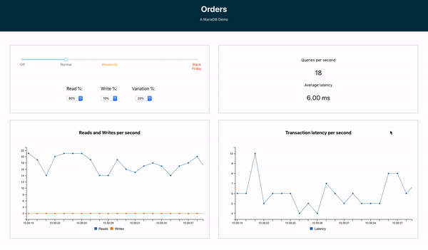

# Orders

**Orders** is a web application written in [React.js](https://reactjs.org) and [Node.js](https://nodejs.org) that, backed by the power of the [MariaDB Node.js Connector](https://github.com/MariaDB/mariadb-connector-nodejs), introduces you to the power, performance, and simplicity of [MariaDB](https://mariadb.com/products/) by simulating online eCommerce (ordering) traffic.

<p align="center" spacing="10">
    <kbd>
        
    </kbd>
</p>

The following will walk you through the steps for getting this application up and running (locally) within minutes! This application is completely open source. Please feel free to use it and the source code as you see fit! 

# Table of Contents
1. [Environment and Compatibility](#compatibility)
2. [Getting start with MariaDB](#overview)
    1. [The Basics](#intro-mariadb)
    2. [Create the schema](#create-schema)
3. [Requirements to run the app](#requirements)
4. [Getting started with the app](#getting-started)
    1. [Grab the code](#grab-code)
    2. [Build the code](#build-code)
    3. [Run the app](#run-app)
5. [Support and Contribution](#support-contribution)
6. [License](#license)

## Environment and Compatibility <a name="compatibility"></a>

This sample was created using the following techologies:

* [MariaDB Platform](https://mariadb.com/products/)
* [React.js (v.16.12.0)](https://github.com/facebook/react/blob/master/CHANGELOG.md#16120-november-14-2019)
* [Node.js (v.12.x)](https://nodejs.org/docs/latest-v12.x/api/index.html)
* [NPM (v.6.11.3)](https://docs.npmjs.com/)

This sample was tested on macOS v.10.14.6.

## Overview <a name="overview"></a>

### Introduction to MariaDB <a name="intro-mariadb"></a>

[MariaDB platform](https://mariadb.com/products/mariadb-platform/) unifies [MariaDB TX (transactions)](https://mariadb.com/products/mariadb-platform-transactional/) and [MariaDB AX (analytics)](https://mariadb.com/products/mariadb-platform-analytical/) so transactional applications can retain unlimited historical data and leverage powerful, real-time analytics in order to provide data-driven customers with more information, actionable insight and greater value – and businesses with endless ways to monetize data. It is the enterprise open source database for hybrid transactional/analytical processing at scale.

<p align="center">
    <kdb>
        
    </kbd>
</p>

### Getting start with MariaDB <a name="installation"></a>

To download and deploy MariaDB HTAP check out the instructions [here](https://mariadb.com/docs/deploy/installation/). You can also make use of the [MariaDB Image available on Docker Hub](https://hub.docker.com/_/mariadb).

### Create the schema <a name="create-schema"></a>

Next you can create the schema necessary for this application by running

```
$ ./create_schema.sh
```

or executing the SQL within (create.sql)(schema/create.sql) directly

```sql
CREATE DATABASE `orders`;

CREATE TABLE `orders` (
  `description` varchar(100) NOT NULL DEFAULT ''
) ENGINE=InnoDB;
```

## Requirements to run the app <a name="requirements"></a>

This project assumes you have familiarity with building web applications using [ReactJS](https://reactjs.org) and [NodeJS](https://nodejs.org) technologies. 

The following is required to run this application:

1. [Download and install MariaDB](#installation). 
2. [Download and install Node.js](https://nodejs.org/en/download/).
3. git (Optional) - this is required if you would prefer to pull the source code from GitHub repo.
    - Create a [free github account](https://github.com/) if you don’t already have one
    - git can be downloaded from git-scm.org

## Getting started with the app <a name="getting-started"></a>

### Grab the code <a name="grab-code"></a>

Download this code directly or use [git](git-scm.org) (through CLI or a client) to retrieve the code.

### Configure the code <a name="configure-code"></a>

Configure the MariaDB connection by [adding an .env file to the Node.js project](https://github.com/mariadb-corporation/mariadb-connector-nodejs/blob/master/documentation/promise-api.md#security-consideration).

Example implementation:

```
DB_HOST=<host_address>
DB_PORT=<port_number>
DB_USER=<username>
DB_PASS=<password>
DB_NAME=<database>
```

The environmental variables from `.env` are used within the [db.js](src/db.js) for the MariaDB Node.js Connector configuration pool settings:

```javascript
var mariadb = require('mariadb');
require('dotenv').config();

const pool = mariadb.createPool({
    host: process.env.DB_HOST, 
    user: process.env.DB_USER, 
    password: process.env.DB_PASS,
    port: process.env.DB_PORT,
    multipleStatements: true,
    connectionLimit: 5
});
```

### Build the code <a name="build-code"></a>

Once you have retrieved a copy of the code you're ready to build and run the project! However, before running the code it's important to point out that the application uses several Node Packages.

Executing the CLI command 

```
$ npm install
```

within  

* [src](src): the Node.js project
* [client](src/client): the React.js project 

folders will target the the relative `package.json` file and [install all dependencies](https://docs.npmjs.com/downloading-and-installing-packages-locally).

### Run the app <a name="run-app"></a>

Once you've pulled down the code and have verified that all of the required Node packages are installed you're ready to run the application! It's as easy as 1,2,3.

1. Using a command line interface (CLI) navigate to the [src](src) directory.

<p align="center">
    
</p>

2. Run the command:

```bash
$ npm start
```

<p align="center">
    
</p>

3. Open a browser window and navigate to http://localhost:3000.

<p align="center">
    <kbd>
        
    </kbd>
</p>

## Support and Contribution <a name="support-contribution"></a>

Thanks so much for taking a look at the Bookings app! As this is a very simple example, there's plenty of potential for customization. Please feel free to submit PR's to the project to include your modifications!

If you have any questions, comments, or would like to contribute to this or future projects like this please reach out to us directly at developers@mariadb.com or on [Twitter](https://twitter.com/mariadb).

## License <a name="license"></a>
[](https://opensource.org/licenses/Apache-2.0)