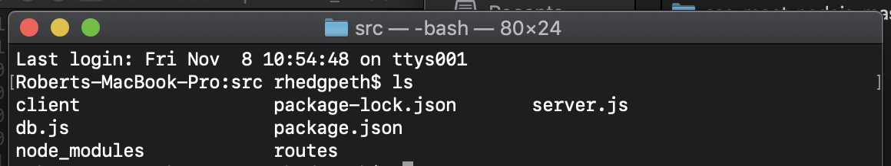

# Places

**Places** is a web application written in [ReactJS](https://reactjs.org) and [NodeJS](https://nodejs.org) that, backed by the power of the [MariaDB Node Connector](https://github.com/MariaDB/mariadb-connector-nodejs) and [MariaDB platform](https://mariadb.com/products/mariadb-platform/), allows you to record all of your favorite locations!

<p align="center">
    
</p>

This `README` will walk you through the steps for getting this app up and running (locally) within minutes!

# Table of Contents
1. [Overview](#overview)
    1. [Introduction to MariaDB](#intro-mariadb)
    2. [Using JSON in a relational database](#json-relational)
2. [Requirements](#requirements)
3. [Getting started](#getting-started)
    1. [Grab the code](#grab-code)
    2. [Build the code](#build-code)
    3. [Run the app](#run-app)
4. [JSON Data Models](#data-models)
5. [Support and Contribution](#support-contribution)

## Overview <a name="overview"></a>

### Introduction to MariaDB <a name="intro-mariadb"></a>

[MariaDB platform](https://mariadb.com/products/mariadb-platform/) unifies [MariaDB TX (transactions)](https://mariadb.com/products/mariadb-platform-transactional/) and [MariaDB AX (analytics)](https://mariadb.com/products/mariadb-platform-analytical/) so transactional applications can retain unlimited historical data and leverage powerful, real-time analytics in order to provide data-driven customers with more information, actionable insight and greater value – and businesses with endless ways to monetize data. It is the enterprise open source database for hybrid transactional/analytical processing at scale.

<p align="center">
    
</p>

### Using JSON in a relational database <a name="json-relational"></a>

[JSON](https://www.json.org) is fast becoming the standard format for data interchange and for unstructured data, and MariaDB Platform (in fact, all MariaDB versions 10.2 and later) include a range of [JSON supporting functions](https://mariadb.com/topic/json/).

The Places application uses only a **single table** for all location, and uses JSON to store more specific information based on the location type.

```sql
CREATE TABLE `Locations` (
  `id` int(11) unsigned NOT NULL AUTO_INCREMENT,
  `name` varchar(100) NOT NULL DEFAULT '',
  `description` varchar(500) DEFAULT '',
  `type` char(1) NOT NULL DEFAULT '',
  `latitude` decimal(9,6) NOT NULL,
  `longitude` decimal(9,6) NOT NULL,
  `attr` longtext CHARACTER SET utf8mb4 COLLATE utf8mb4_bin DEFAULT NULL CHECK (json_valid(`attr`)),
  PRIMARY KEY (`id`)
) ENGINE=InnoDB AUTO_INCREMENT=19 DEFAULT CHARSET=utf8mb4;
```

For more information on how JSON can be used within MariaDB please check out this [blog post](https://mariadb.com/resources/blog/json-with-mariadb-10-2/)!


## Requirements <a name="requirements"></a>

This project assumes you have familiarity with building web applications using ReactJS and NodeJS technologies. 

* Download and install [MariaDB](https://go.mariadb.com/download-mariadb-server-community.html?utm_source=google&utm_medium=ppc&utm_campaign=MKG-Search-Google-Branded-DL-NA-Server-DL&gclid=CjwKCAiAwZTuBRAYEiwAcr67OUBIqnFBo9rUBhYql3VZV_nhlSKzkwoUv7vhA6gwNdGoBSc2uWe7SBoCX_oQAvD_BwE). 
* Download and install [NodeJS](https://nodejs.org/).
* git (Optional) - this is required if you would prefer to pull the source code from GitHub repo.
    - Create a [free github account](https://github.com/) if you don’t already have one
    - git can be downloaded from git-scm.org

## Getting started <a name="getting-started"></a>

In order to run the Places application you will need to have a MariaDB instance to connect to. For more information please check out "[Get Started with MariaDB](https://mariadb.com/get-started-with-mariadb/)".

In order to build and run the Places applications you will need to have NodeJS installed. You can find more information [here](https://nodejs.org/).

### Create the schema <a name="create-schema"></a>

Using CLI or SQL client run the following SQL command:

```sql
CREATE TABLE `Locations` (
  `id` int(11) unsigned NOT NULL AUTO_INCREMENT,
  `name` varchar(100) NOT NULL DEFAULT '',
  `description` varchar(500) DEFAULT '',
  `type` char(1) NOT NULL DEFAULT '',
  `latitude` decimal(9,6) NOT NULL,
  `longitude` decimal(9,6) NOT NULL,
  `attr` longtext CHARACTER SET utf8mb4 COLLATE utf8mb4_bin DEFAULT NULL CHECK (json_valid(`attr`)),
  PRIMARY KEY (`id`)
) ENGINE=InnoDB AUTO_INCREMENT=19 DEFAULT CHARSET=utf8mb4;
```

### Grab the code <a name="grab-code"></a>

Download this code directly or use [git](git-scm.org) (through CLI or a client) to retrieve the code.

### Configure the code <a name="configure-code"></a>

**The gist;** Add a Google Maps API Key and database connection information to the code.

1. Once you've obtained a Google Maps API Key place add it to the code [here](src/client/src/components/MapContainer.js#L248).

```js
export default GoogleApiWrapper({
    apiKey: ("ENTER_GOOGLE_API_KEY")
})(MapContainer)
```

2. Update the MariaDB connection configuration [here](src/db.js#L4).

```js
const pool = mariadb.createPool({
    host: 'localhost', 
    user:'ENTER_USERNAME_HERE', 
    password: 'ENTER_PASSWORD_HERE',
    database: 'Places',
    multipleStatements: true,
    connectionLimit: 5
});
```

### Build the code <a name="build-code"></a>

Now that you have a copy of the code you're ready to build and run the project. However, before running the code it's important to point out that the application uses several Node Packages.

**Client-side**

Navigate to the [client directory](https://github.com/mariadb-corporation/Developer-Examples/tree/master/Places/src/client) and install the following packages:

- [google-maps-react](https://www.npmjs.com/package/google-map-react)
- [props-type](https://www.npmjs.com/package/props-type)
- [react](https://www.npmjs.com/package/react)
- [react-datepicker](https://www.npmjs.com/package/react-datepicker)
- [react-dom](https://www.npmjs.com/package/react-dom)
- [react-modal](https://www.npmjs.com/package/react-modal)
- [react-scripts](https://www.npmjs.com/package/react-scripts)

**Server-side**

Navigate to the [src directory](https://github.com/mariadb-corporation/Developer-Examples/tree/master/Places/src) and install the following packages:

- [body-parser](https://www.npmjs.com/package/body-parser)
- [concurrently](https://www.npmjs.com/package/concurrently)
- [express](https://www.npmjs.com/package/express)
- [mariadb](https://www.npmjs.com/package/mariadb) (the best database in world)


### Run the app <a name="run-app"></a>

Once you've pulled down the code and have verified that all of the required Node packages are installed you're ready to run the application! It's as easy as 1,2,3.

1. Using a command line interface (CLI) navigate to where to the [src directory](https://github.com/mariadb-corporation/Developer-Examples/blob/master/Places/src/) of Places.

<p align="center">
    
</p>

2. Run the command:

```bash
npm start
```

<p align="center">
    
</p>

3. Open a browser window and navigate to http://localhost:3000.

## JSON Data Models <a name="data-models"></a>

Below are samples of the data model per Location Type. 

**Attraction**
```json
{
   "category":"Landmark",
   "lastVisitDate":"11/5/2019"
}
```

**Location**
```json
{
   "details":{
      "foodType":"Pizza",
      "menu":"www.giodanos.com/menu"
   },
   "favorites":[
      {
         "description":"Classic Chicago",
         "price":24.99
      },
      {
         "description":"Salad",
         "price":9.99
      }
   ]
}
```

**Sports Venue**
```json
{
   "details":{
      "yearOpened":1994,
      "capacity":23500
   },
   "events":[
      {
         "date":"10/18/2019",
         "description":"Bulls vs Celtics"
      },
      {
         "date":"10/21/2019",
         "description":"Bulls vs Lakers"
      },
      {
         "date":"11/5/2019",
         "description":"Bulls vs Bucks"
      },
      {
         "date":"11/5/2019",
         "description":"Blackhawks vs Blues"
      }
   ]
}
```

## Support and Contribution <a name="support-contribution"></a>

Thanks so much for taking a look at the Places app! As this is a very simple example,there's a lot of potential for customization! 

If you have any questions, comments, or would like to contribute to this or future projects like this please reach out to us directly at developers@mariadb.com or on [Twitter](https://twitter.com/mariadb).
