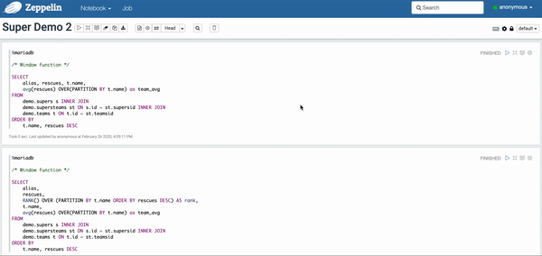
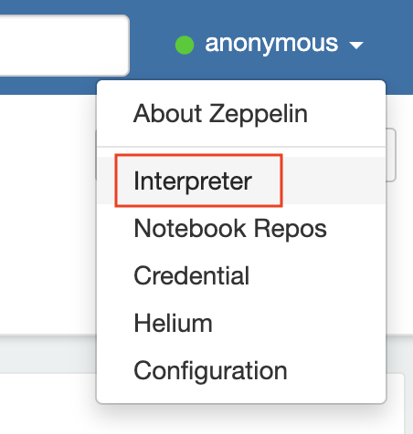
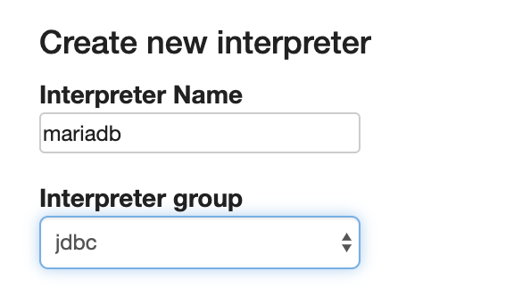
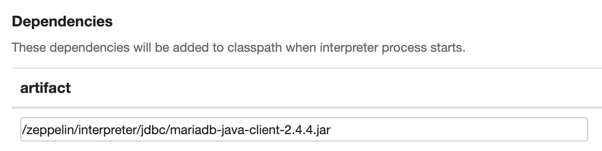
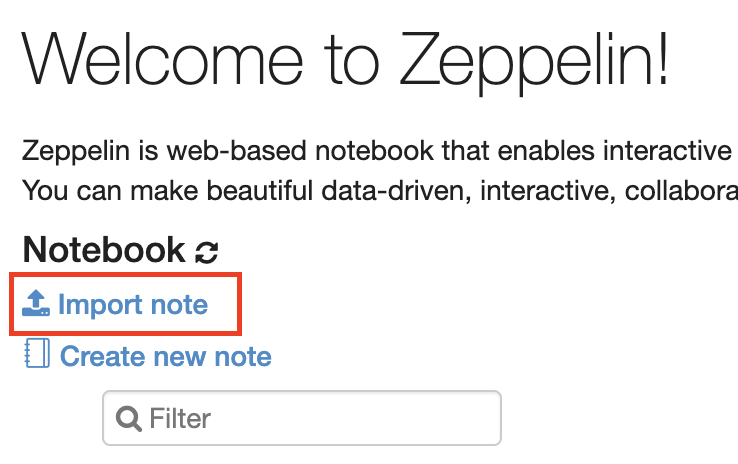

# Modern SQL, MariaDB, and Apache Zeppelin!

[MariaDB](http://www.mariadb.com) implements more of the standard SQL specification than any other open source database, adding support for [common table expressions (CTEs)](https://mariadb.com/kb/en/with/), [window functions](https://mariadb.com/kb/en/window-functions/), [temporal data tables](https://mariadb.com/kb/en/temporal-data-tables/) and many other features over the last few years. 

<p align="center" spacing="10">
    <kbd>
        
    </kbd>
</p>

The following will walk you through the steps for setting up [Apache Zeppelin](https://zeppelin.apache.org/) to integrate with MariaDB and work with several samples of modern SQL functionality. 

# Table of Contents
1. [Environment and Compatibility](#compatibility)
2. [Getting started with MariaDB](#overview)
    1. [The Basics](#intro-mariadb)
    2. [Downloading and installing MariaDB](#installation)
3. [Requirements](#requirements)
4. [Getting started with Apache Zeppelin](#getting-started)
5. [Support and Contribution](#support-contribution)
6. [License](#license)

## Environment and Compatibility <a name="compatibility"></a>

This sample was created using the following techologies:

* [MariaDB](https://mariadb.com/products/mariadb-platform/)
* [Apache Zeppelin](https://zeppelin.apache.org/)

This application was tested on [macOS Mojave v.10.14.6](https://developer.apple.com/documentation/macos_release_notes/macos_mojave_10_14_6_release_notes).

## Overview <a name="overview"></a>

### Introduction to MariaDB <a name="intro-mariadb"></a>

[MariaDB platform](https://mariadb.com/products/mariadb-platform/) unifies [MariaDB TX (transactions)](https://mariadb.com/products/mariadb-platform-transactional/) and [MariaDB AX (analytics)](https://mariadb.com/products/mariadb-platform-analytical/) so transactional applications can retain unlimited historical data and leverage powerful, real-time analytics in order to provide data-driven customers with more information, actionable insight and greater value – and businesses with endless ways to monetize data. It is the enterprise open source database for hybrid transactional/analytical processing at scale.

### Getting start with MariaDB <a name="installation"></a>

To download and deploy MariaDB check out the instructions [here](https://mariadb.com/docs/deploy/installation/). You can also make use of the [MariaDB Image available on Docker Hub](https://hub.docker.com/_/mariadb).

### Create the schema <a name="create-schema"></a>

Next you can create the schema necessary for this application by running

```
$ /<path_to>/create_schema_data.sh
```

or copying the SQL within [create_schema_data.sql](create_schema_data.sql) directly.

## Requirements <a name="requirements"></a>

This project assumes you have familiarity with building web applications using ReactJS and NodeJS technologies. 

* Download and install [MariaDB](#installation). 
* Download and install [Apache Zeppelin](https://zeppelin.apache.org/download.html).
* git (Optional) - this is required if you would prefer to pull the source code from GitHub repo.
    - Create a [free github account](https://github.com/) if you don’t already have one
    - git can be downloaded from git-scm.org

## Getting started with Apache Zeppelin<a name="getting-started"></a>

### Adding a MariaDB interpreter

Once you've downloaded and installed Apache Zeppelin you will need to add a new [interpreter](https://zeppelin.apache.org/docs/0.8.2/usage/interpreter/overview.html) for MariaDB using the following steps:

1. Navigate to "Interpreter".

<p align="center" spacing="10">
    <kbd>
        
    </kbd>
</p>

2. Click the "Create" button.

3. Enter a name for the interpreter and select an "Interpreter group" of `jdbc`.

<p align="center" spacing="10">
    <kbd>
        
    </kbd>
</p>

4. Assign value of **org.mariadb.jdbc.Driver** to `default.driver`.

5. Assign value of **jdbc:mariadb://<database_address>/** (where <database_address> is the location of your MariaDB database instance) to `default.url`.

6. Assign value to `default.user`.

7. Assign value to `default.password`.

8. Add the location of the [JDBC driver](https://mariadb.com/downloads/#connectors) as an artifact.

<p align="center" spacing="10">
    <kbd>
        
    </kbd>
</p>

### Importing the notebooks

Import the notes:

* [demo_1.json](demo_1.json): Set operators, table value constructors, aggregation functions, and rollups. 
* [demo_2.json](demo_2.json): Window functions and common table expressions (recursive).
* [demo_3.json](demo_3.json): Temporal tables.

by selecting "Import note".

<p align="center" spacing="10">
    <kbd>
        
    </kbd>
</p>


## Support and Contribution <a name="support-contribution"></a>

If you have any questions, comments, or would like to contribute to this or future projects like this please reach out to us directly at developers@mariadb.com or on [Twitter](https://twitter.com/mariadb).

## License  <a name="license"></a>
[](https://opensource.org/licenses/Apache-2.0)
